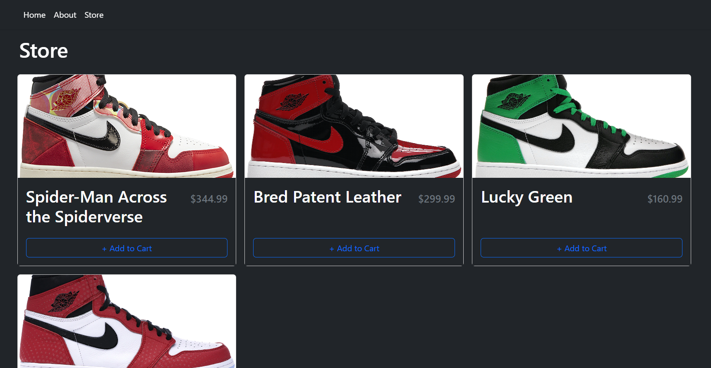

# Shopping Cart
A shopping cart that allows the user to update items in cart and utilizes localStorage for persistence.

**Link to project:** https://tangerine-ganache-9cb834.netlify.app/

## How It's Made:

**Tech used:** HTML, CSS, JavaScript, React, Vite, TypeScript & Bootstrap

A straight forward shopping cart application with the primary focus of learning more about TypeScript.

## Optimizations

Utilized localStorage so that shopping cart items persist without a backend in place. The homepage and about page need to be further built out to give it a little life.

## Lessons Learned:

I created this simple shopping cart application to start implementing Types in TypeScript. It was a fairly straight forward task. Learning what Types are was easy, the syntax is something I wanted to spend some time practicing. 

## Examples:
Take a look at these couple examples that I have in my own portfolio:

**Level Ground MMA:** https://github.com/THREEhundo/level-ground

**Pokemon TCG Memory Game:** https://github.com/THREEhundo/pokemon-tcg-memory-game

